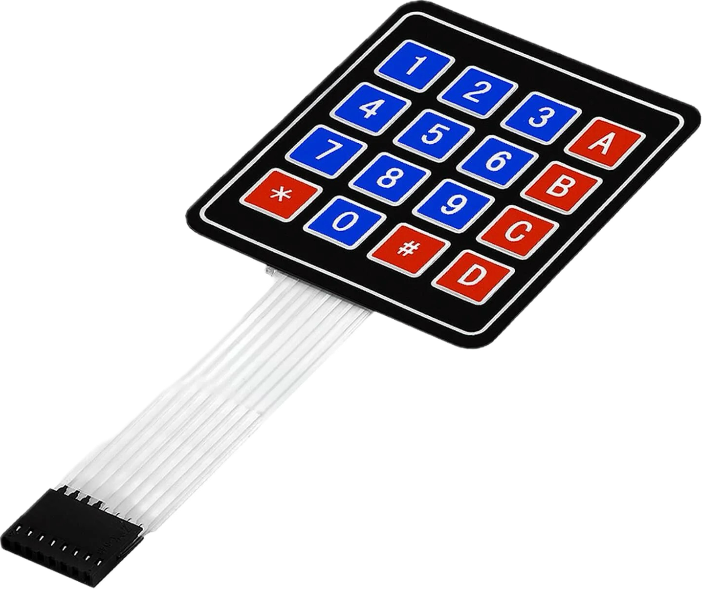

# TicTacToe

a simple tic-tac-toe game for Arduino board.
I wrote the code with [@Burgerlein](https://github.com/Burgerlein) in college class

# Arduino Board

* 4 Led Matrizen
* 1 Arduino Mega
* 1 LCD Display
* 1 KeyPad

# To Dos
- [ ] Refaktoring der check funktionen