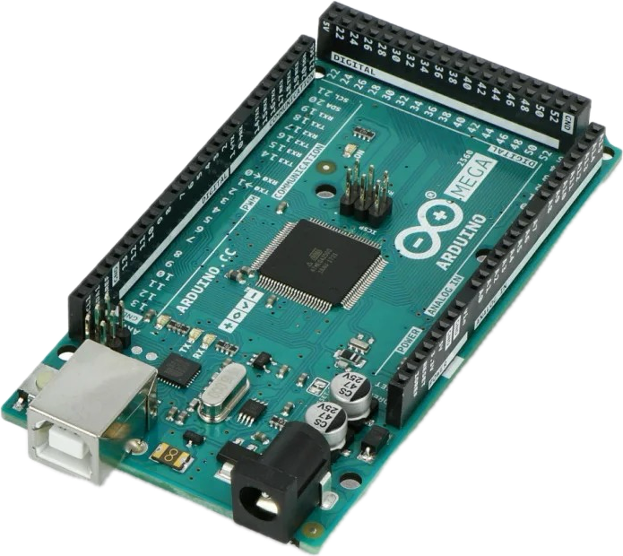
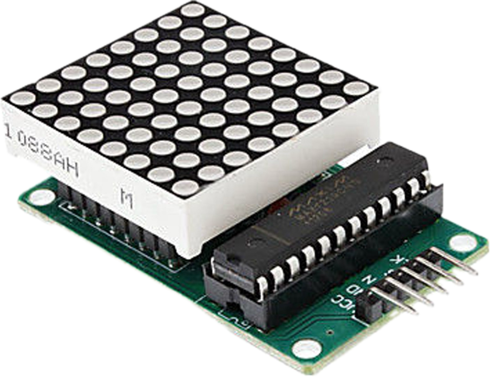
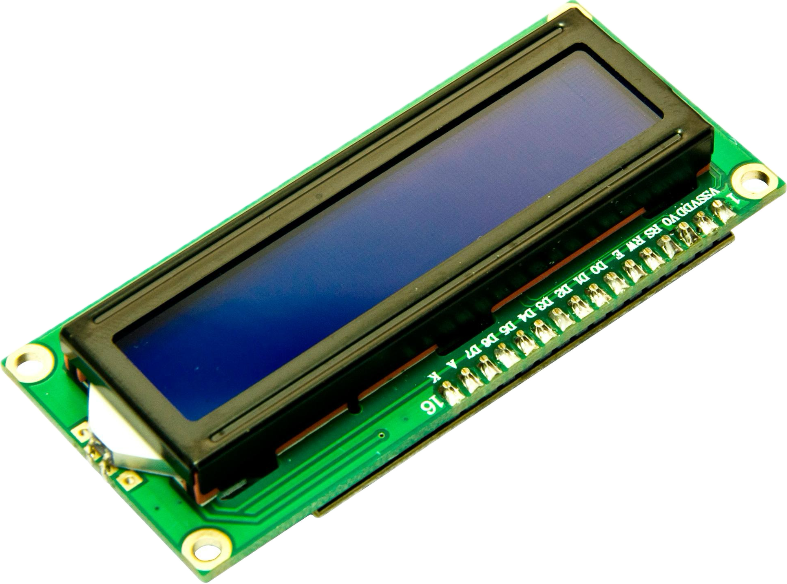

# TicTacToe

a simple tic-tac-toe game for Arduino board.
I wrote the code with [@Burgerlein](https://github.com/Burgerlein) in college class

# Arduino Board

| Syntax      | Description | Description |
| ----------- | ----------- | ----------- |      
| 1      | Arduino Mega      |  |
| 4      | Led Matrizen      |  |
| 1      | LCD Display      |  |
| 1      | KeyPad      |  |
| 3      | Header      | Title |

# To Dos
- [ ] Refaktoring der check funktionen